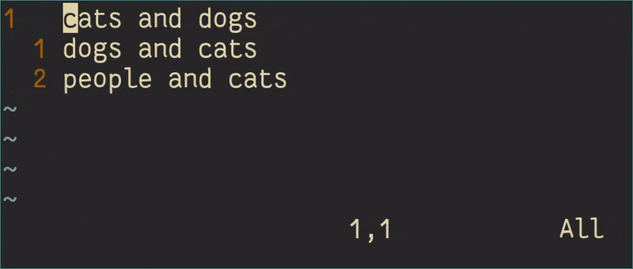
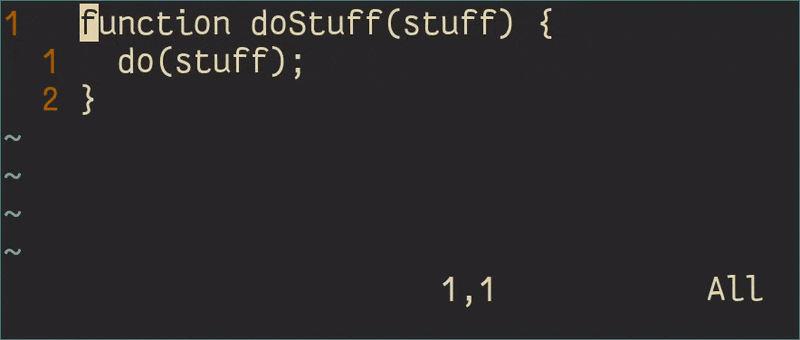
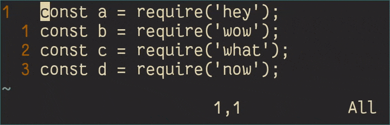
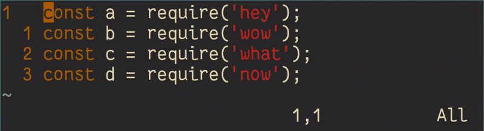
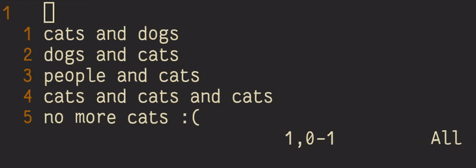
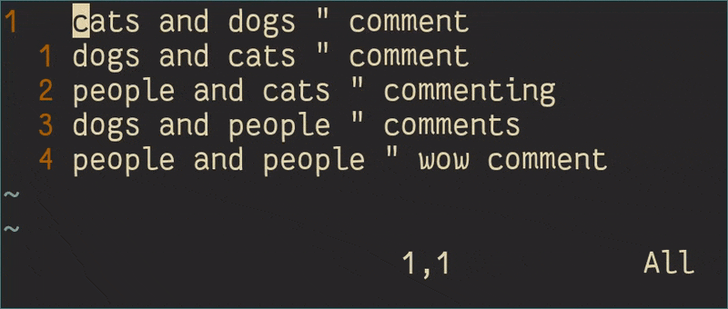
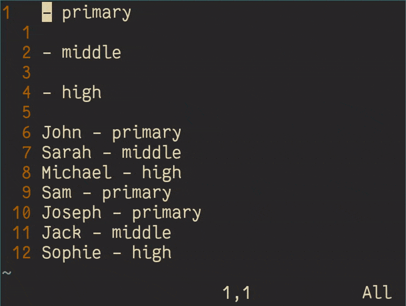

+++
title = "8 Vim tips and tricks for advanced beginners"
description = "Some tips and tricks to help you overcome the valley of despair and become an advanced Vim user."
aliases = ["/blog/2019-01-06-beginner-advanced-vim-tips-and-tricks/"]
[taxonomies]
tags = ["vim", "neovim", "beginner"]
+++

A few weeks ago, I saw [this](https://robertheaton.com/2018/12/08/programming-projects-for-advanced-beginners/) post by Robert Hearton which outlined a few programming projects for advanced-beginners.
It talked about the idea of the "valley of despair", and offered up some ways that might help you get out of it.
This got me thinking about my experience with Vim.

It occurred to me that now that I'm using Vim (or the Vim input method) for basically every text editing task with little frustration, I'm on the upward hill out of this valley of despair. So I'd like to share some tips and tricks that just might help you do the same.

## 0. Become an "Advanced Beginner"

This article is predominantly targeted towards people who've been using Vim for a little while.
So I'm going to assume that you know about the different modes, you can move around and you can use a few ex commands (`:q`).

I'm also going to assume that you've somewhat configured Vim to your liking (at least `set number relativenumber`), and you're comfortable with how everything works.

## 1. Using search

The first thing you try and do in a text editor, after learning the basics, is search.
In Vim, searching, substituting and the global command are some of the most powerful commands you can use.

- Search under the cursor

  You can search for the current word under the cursor by using the `*` and `#` commands in normal mode.
  This can be useful when the search term is quite long, or you're writing a macro that needs to search for something.

  

- Reinsert substituted text

  Using the `&` you can reinsert the text matched in a substitution.

  ```
  :%s/cats/"&"/g
  ```

  

* Substitute capture groups
  You can dictate capture groups using escaped brackets in a search. They can then be accessed in the replacement using escaped numbers.

  ```
  :%s/\(\w\) and/\1 but not/g
  ```

  

## 2. Text objects

Text objects were probably my most favorite thing about Vim when I found out about them - mainly because they were so different to what I was used to, but so convenient!
Text objects can are regions of text that can be manipulated as if they were selected using visual mode.
The most commonly used text object is `w`, or "word". When you first begin using Vim, you're taught to move around by words.
You're taught to change words (`cw`), yank words (`yw`) and delete words (`dw`).
To get an idea of all the text objects that exist, use the `:help text-objects` command from inside Vim. Here's just a few that I often use:

- `i(`, `i{`, `it`

  This text objects stands for "inner bracket", and is the space between two matching brackets.
  I often use this to quickly change whats inside function parameters.

  ```
  f(          " find the bracket
  ci(nothing  " change inner bracket to "nothing"
  +f(.        " repeat the action on the next line
  ```

  

- `a"`, `i"`

  Like above, you can very easily change / delete strings by using the `a"` or `i"` text objects, which match the `"` character.

- `it`, `at`

  The "inner tag" or "a tag" text objects are great when working with HTML, for the aforementioned reasons.

- `gn`

  This is a surprisingly useful one. This text object is the next occurrence of the last used search pattern.
  `cgn` or `dgn` to change / delete the next occurence of a search is very convenient, especially when used with `#`.

<span id="3-motion" />

## 3. Motion

Learning how to use `hjkl` is not the end of movement in Vim, there's a number of ways to get around.

- `f` / `F` and `t` / `T` to find characters

  You can find move the cursor to a particular character by using the `f` command to move forward, and `F` to move backward.
  This can be incredibly useful when the alternative is smashing the `l` key a million times.
  These movements can also be incredibly useful when changing text.
  `ct;` for example, will delete from where you are until a semi-colon, and leave you in insert mode.

- `A` and `I` to insert at the start and end

  Instead of `^i` or `$a`, you can use the useful capitalised versions as shortcuts to insert at the start or end of a line.

- `+` and `o` to go to the next line

  If you want to go to the start of the next line (popular in macros), you might use the command `j^`.
  Vim foresaw it's popularity and included the `+` command to do the same thing instead.

  Likewise, wanting to insert on the next line, you might be tempted to `A<Enter>` to append a new line to the end of the current one.
  Instead, you can press `o` to insert on the next line or `O` to insert on the previous line (indentation preserved).

- `|` or the screen column

  This motion is a particular screen column on the current line.
  For example, `10|` is 10 characters from the left of the screen.
  For me, this is almost exclusively used to align comments on text.
  Check the [cute tricks](#8-some-cute-tricks) section to see it.

## 4. Markers

Markers or marks are another part of Vim that can really speed up your work-flow.
Being able to edit multiple parts of multiple files can be really useful.

- Set markers

  You can set a marker at any location in a file using the `m{char}` command.
  To set a marker "k", issue the command `mk`.
  To visit this marker, issue the command \`k.

  Note: lowercase markers are specific to a particular file that you're editing.
  If you use a capital letter or a number, it will be across all buffers / files.

- \`\`

  After a movement, you can return to your previous location by using the \`\` command.

  ```
  /hey<Enter> " jump to first match of hey
  ``          " move back to start
  ```

- `Ctrl-^`

  Similar to the previous command, this will send you back to the previous buffer that you were in.

  For example, if you need to quickly edit a file called "hey.txt", you could open it, edit it, and then return to your previous file.

  ```
  :e ./hey.txt<Enter> " open a file called "hey.txt"
  isome changes<Esc>  " insert the changes
  <Ctrl-^>            " go back to previous file
  ```

## 5. Macros

Whenever I repeat anything in Vim, a little voice in the back of my head scolds me - "You should have used a macro!"
At first, it often seems counter productive to create a macro, many believe that macros are often only used for complex tasks.

The better you get at Vim, however, the more you begin to realise that simple tasks are great for macros.
Here's a few tips for making macros work more often.

- Don't move in insert mode

  This was quite frustrating for me to learn, but moving in insert mode (using the arrow keys) just doesn't work.
  Instead, you have to press `Esc` and move using normal mode commands.

  Alternatively, you can execute one normal mode command, from insert mode, by pressing `Ctrl-o` and then issuing the command.

- Move carefully

  An easy way to muck up a macro is to move by a number, or worse - spamming the `l` key.
  Instead, move in a way that you know will scale to every line.

  A few ideas:

  - Search for keywords on the next line
  - Use `f` and `F`, `w` and `W`
  - Search under the cursor

- Start at the start, end with a `+`

  It's important that each iteration of a macro starts at the exact same spot - a sort of clean slate.
  The following command brings together everything, finishing off the macro on the next line with `+`.

  ```
  qq                 " start macro "q"
  cwimport * as<Esc> " change word to "import * as"
  f=w                " find "=" and move forward a word
  ct'from <Esc>      " change until "'" to "from"
  f)x                " find ")" and remove it
  +q                 " finish macro on next line
  3@q                " Repeat the macro thrice
  ```

  

## 6. Visual block

Sublime Text and Visual Studio Code both have ways of inserting on multiple lines - through the use of "multiple cursors".
Vim has a similar way of inserting on multiple lines, known as Visual Block mode.
Visual Block mode is closely related to Visual mode, with the exception that your selection need not wrap entire lines.

Using this, you can easily comment out blocks of code, or append text to lines.



Apart from that, you can can also cut blocks, delete blocks and do a whole lot more. Check `:help visual-block` for more info.

## 7. Finding help

The best way to learn new things about Vim, is to spend some time reading through the `:help` file.
To get to this, write `:help` from normal mode, it will open up a new buffer populated by the help file.
I'd really recommend spending some time to get familiar with the details of Vim features - it's actually a pretty interesting read, and you'll learn a lot.
To better understand how the help file works and how to search better, look at `:help help-summary`.

Another great part of the `:help` files, is the Vim Reference Manual, located at `:help quickref.txt`.
If you don't have time to read the entire help file, you could at least skim through this.

Finally, if you're not already playing [VimGolf](https://www.vimgolf.com/), you definitely should be!
It's a super fun game that requires you transform a piece of text using the least number of commands possible.
You'll be super surprised about how easily people can achieve some complex transformations.

If after all this, you're still craving some more Vim tips. I'd suggest reading the book [Practical Vim - Edit Text at the Speed of Thought](https://pragprog.com/book/dnvim2/practical-vim-second-edition) by Drew Neil.

<span id="8-some-cute-tricks" />

## 8. Some cute tricks

- Search and change

  Whenever you want to search and replace some text, you might immediately use the substitute command (`:%s`).
  If you want to only change a certain number of matches however, this doesn't work so well.
  Instead, you can use the new search match (`gn`) text object with the change command (`c`) to change searches.
  This small action can then be repeated as many times as you like using the "repeat last command" command (`.`).

  ```text
  /cats<Enter> " search for "cats"
  cgndogs<Esc> " change the next search match to "dogs"
  .            " repeat the last command
  ```

  

- Align comments

  A common task for a programmer to do is to align comments, or imports or variables.
  This is often done using a plugin or a tediously pressing the space-bar.
  In Vim, you need to do neither!
  Rather, you use the `|` command mentioned in the [motion](#3-motion) section.

  ```
  qq        " start a macro "q"
  f"        " find the " character
  10i <Esc> " insert 10 spaces
  d18|      " delete to screen column 18
  +q        " finish the macro on the next line
  4@q       " run the macro 4 times
  ```

  

- Sort a key value list

  Using all the tricks in this article, you can write some pretty complex macros.
  Check out this one to sort a key - value list.

  ```
  6j       " jump down 6 lines
  qq       " start a macro "q"
  yy       " yank the current line
  ww#      " go to the value and search backwards
  I- <Esc> " insert a - at the start of the line
  wwd$>>   " delete the value and indent the line
  ``dd     " jump back and delete the line
  q6@q     " finish the macro and repeat 6 times
  ```

  

## What next

At this point you probably know quite a lot about Vim.
You've read an understood the help file, you're a VimGolf pro and you're using Vim for pretty much everything.
If you haven't got any plugins installed, this might be the time to start.
While many people default to using plugins, an experienced Vim user will realise they're barely necessary.

Unfortunately, for advanced IDE features, you're going to need some kind of linting and completion support.
To help you understand what these integrations can do, have a look at `:help quickfix`.

Thanks for reading!
