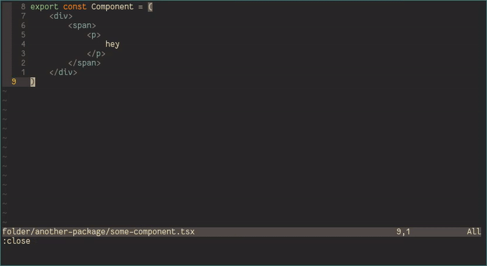
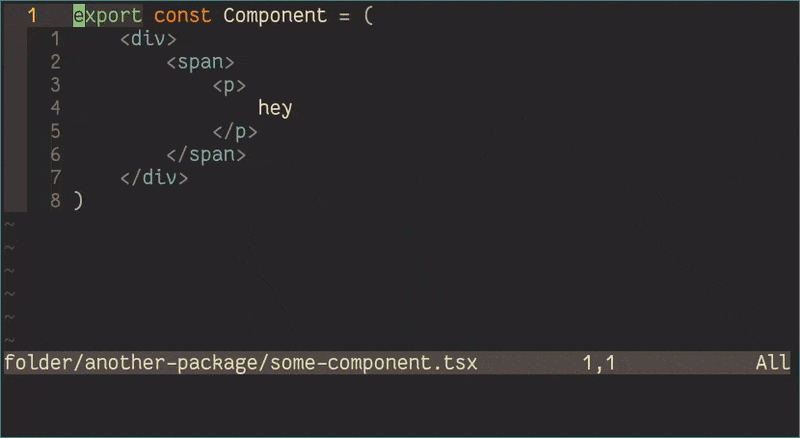
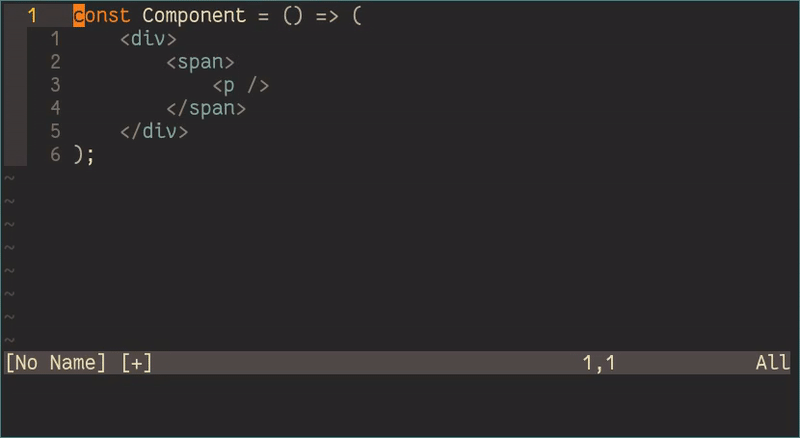

+++
title = "Using Vim as a web development IDE"
description = "I traded in VSCode and started using neovim as my full-time IDE - here's what I learned."
alises = ["/blog/2019-06-23-vim-as-an-ide-for-web-developers/"]
[taxonomies]
tags = ["vim","javascript","react"]
+++

Two weeks ago I decided to make the jump - finally changing from Microsoft's Visual Studio Code (Code) editor to Vim.
Despite months and months of strenuous [golfing](http://www.vimgolf.com/), there was always something in my road when I tried to change editors.

Namely, these things were:

- intellisense and language completion
- search (and replace) in files

Luckily, thanks to projects like [coc.nvim](https://github.com/neoclide/coc.nvim) and learning to love Vim's quick-fix-list and grepping features, they're no longer a problem.

## coc.nvim

CoC stands for "Conquerer of Completion", and is an intellisense and completion engine for vim and neovim.
It has a variety of extensions and a runtime that allows users to create extensions from Code's equivalents, meaning that you have the same completion power you would find in Microsoft's editor.

Needless to say I have found bugs here and there, but by-and-large, I've found the whole experience surprisingly seamless.

### Getting started

After installing CoC and everything is working, I'd suggest installing all the plugins you would typically use in something like VS Code.
For me, these were plugins for Typescript, Rust, Json, Angular and a few others.

When you first set up, I'd suggest installing the great [coc-marketplace](https://github.com/fannheyward/coc-marketplace) plugin.
This plugin allows you to easily install other plugins and search through what's currently available.

You can install it by issuing the following command from Vim:

```
:CocInstall coc-marketplace
```

Once it's installed, you can issue and select some plugins to download:

```
:CocList marketplace
```

If you don't want to install coc-marketplace, you can always [search on npm](https://www.npmjs.com/search?q=keywords%3Acoc.nvim).

### Basic commands

There's a handful of CoC commands that I use on the daily. Mainly, there are `:CocCommand`, `:CocList`, `:CocAction` and `:CocRestart`.
Typically, actions that I often use will have bindings. However, for seldom used features I will find myself typing these out.

From a high level, `CocCommand` is similar to the `<CTRL>-<SHIFT>-P` command in Code.
It will show a window where you can fuzzy search for actions that you can perform.
These are typically things that affect Vim on a global level - such as restarting a particular language server.

`CocAction` on the other hand, relates to actions on the current selected symbol / selection.
This is where things like tslint fixers and formatting lives.

`CocList` is the most useful command when you don't know what you're searching for.
It shows a fuzzy-searchable list that gives you a number of useful commands that you can execute.

### Bindings

I've found that most of the commands in the example configuration from [the coc.nvim repo](https://github.com/neoclide/coc.nvim) are adequate for my setup.

Taken from the example configuration, the bindings that I use the most are:

```
" Remap keys for gotos
nmap <silent> gd <Plug>(coc-definition)
nmap <silent> gy <Plug>(coc-type-definition)
nmap <silent> gi <Plug>(coc-implementation)
nmap <silent> gr <Plug>(coc-references)

...

" Use K to show documentation in preview window
nnoremap <silent> K :call <SID>show_documentation()<CR>

...

" Use `:Format` to format current buffer
command! -nargs=0 Format :call CocAction('format')
```

The `gd` command will go to the definition of the symbol that the cursor is on.
While it is very dependent on the language server, this is by far the most useful feature in CoC and is crucial for speedy movement.

The `gy`, `gi` and `gr` commands are not used as much, but are still very useful.
Whenever I am refactoring or debugging, I will often use `gr` to follow a function up the stack.

The `K` command is another which is very important to me.
The equivalent in Code, is how hovering over a symbol will give you a variety of information such as type definition, as well as any jsdoc comments that the author may have left on the symbol.

Finally I the `:Format` command to format the entire buffer. Neat!

## Search and replace

In many of my early attempts to change to exclusively using Vim, I ran into a a bunch of road-blocks trying to find a solution to search and replace.

First, I tried using the built in `vimgrep` tool. This worked great for small projects, but as soon as I tried to use it on Clipchamp's codebase Vim would grind to a halt.
Using the native grep tool was better, but not instant. Also having to include `**/*.ts` for every search got a bit tedious.

The solution to the problem works in two parts. First, I've updated the grepprg option in Vim to use [ripgrep](https://github.com/BurntSushi/ripgrep) - a drop in replacement for grep that is a whole lot faster.

Ripgrep has a `--vimgrep` option, which allows it to populate the quickfix list. Simply set it as the default vimgrep command like so ([thanks to @pirj](https://github.com/BurntSushi/ripgrep/issues/425#issuecomment-381446152)):

```
set grepprg=rg\ --vimgrep\ --no-heading\ --smart-case
```

Secondly, I use the fantastic ripgrep integration for [fzf.vim](https://github.com/junegunn/fzf.vim) - a plugin that I've already been using for fuzzy file searching.

```
:Rg <search-string>
```

Unfortunately this command (at least by default) does not populate the quickfix list. However I've found that I use this command most when quickly trying to search for things, when I need to perform multiple changes across multiple files, I'll use the first method.

## Other great features

I only have five plugins installed for Vim.

You can find them in [my dotfiles](https://github.com/bennetthardwick/dotfiles/blob/master/.config/nvim/init.d/plugins.vim), or right below:

```
morhetz/gruvbox
junegunn/fzf.vim
airblade/vim-gitgutter
sheerun/vim-polyglot
neoclide/coc.nvim
```

This is because I'm a strong believer in a minimal config - because you don't need a bunch of plugins to have a usable Vim.
In fact, three of my five plugins are completely for aesthetic reasons!

Here's a few cool things I do everyday, that you (could) do with a default Vim.

### Windows and tabs

When working with a lot of files, you need to be able to navigate between a lot quickly.

This is where windows and tabs come in.

In my work flow, multiple windows are used to arrange a contiguous or logical grouping of files.
Different groups of these files are set on different tabs.

```
<C-W>v      " vertical split
:buffer new " open buffer matching "new"
:Sexplore   " horizontal split explorer
:tabnew     " create new tab
:tabclose   " close tab
:close      " close window
:close      " close window
```



### Exploring files

Vim has a great built-in file explorer called netrw.
Issuing `:Explore` will open netrw in the parent directory as the current file.
It can be very useful to create sibling files or directories.

```
:Explore  " open file browser
%         " create a new file
:w        " save file
:Explore  " open file browser
jj<CR>    " navigate and open file
```



### Folding tags

When working with React, it's not always great to fold by syntax.
You might fold styles-components or functions or JSX.
Instead, when you want to just fold tags it can be a lot easier to manually create them yourself.

This can easily be done by selecting the tag in visual mode, an then folding:

```
vat     " select tag
:fold   " create fold
za      " toggle fold
za      " toggle fold
```



---

As always, if you're ever curious about how something works you can issue `:help <command>` from within Vim to grep exhaustive information.
If you're interested in learning more Vim tricks, check out my article on [beginner advanced tips](/blog/2019-01-06-beginner-advanced-vim-tips-and-tricks/).
